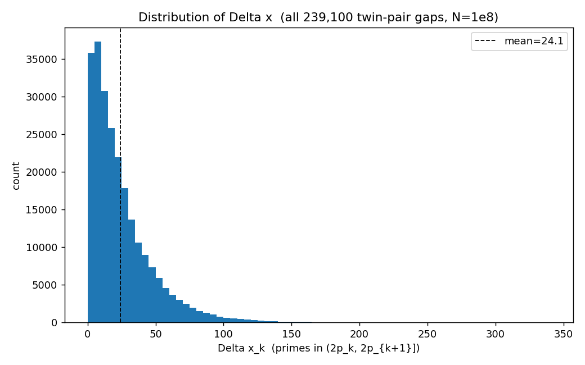
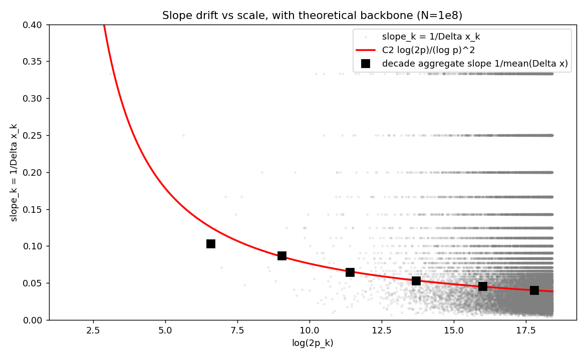
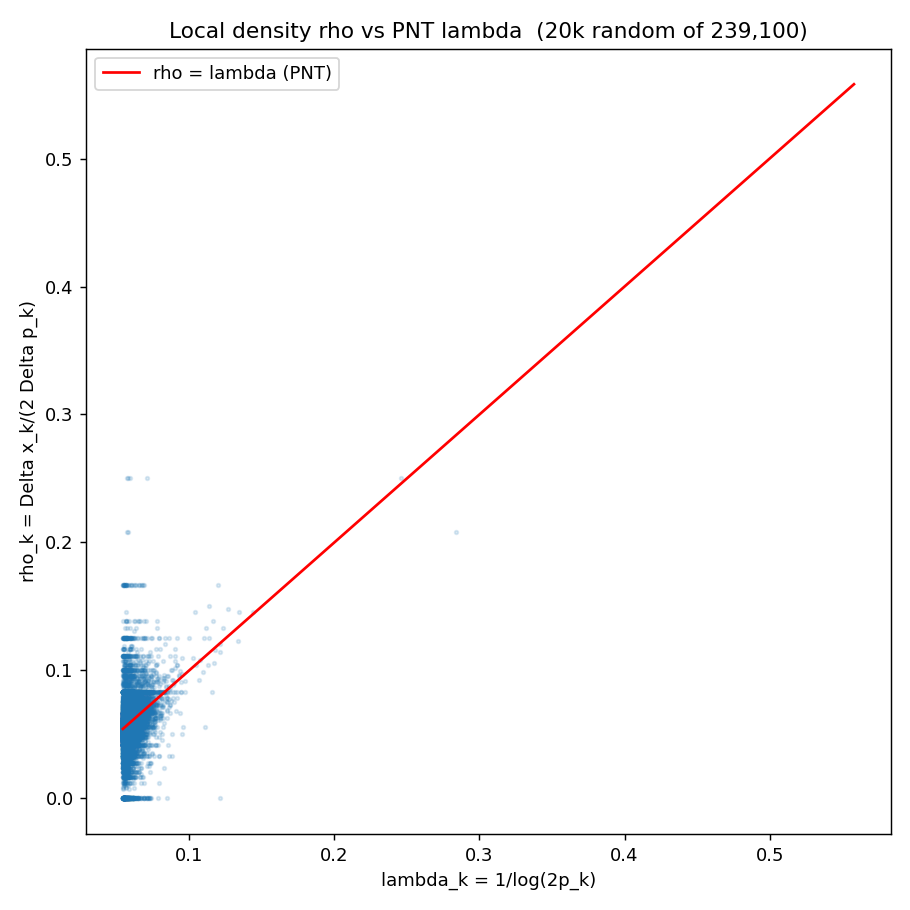

# Prime Geometry II: A Twin-Prime Bertrand Postulate and its Geometric Equivalent

Allen Proxmire

April 2026

---

## Abstract

Let $\pi_2(x)$ denote the number of primes $p\le x$ for which $p+2$ is
also prime. We study the dyadic inequality
$$\pi_2(2x)-\pi_2(x)\ge 1\qquad(x\ge 11),\tag{$\mathrm{TPB}$}$$
which we call the *Twin-Prime Bertrand Postulate*. Statement
$(\mathrm{TPB})$ asserts that every interval of the form $(x,2x]$
contains at least one twin prime, once $x\ge 11$. It sits strictly
between the Zhang--Maynard bounded-gaps theorems, which give infinitely
many prime pairs of bounded gap, and the twin-prime conjecture, which
predicts $\pi_2(x)\to\infty$ at an explicit rate.

We show that $(\mathrm{TPB})$ is equivalent to a purely geometric
statement about the Prime Triangle construction of PG I: every
record-setting pair $(p_n,p_{n+1})$ in the angle sequence
$\alpha_n=\arctan(p_n/p_{n+1})$ with $p_n\ge 3$ is a twin prime. The
equivalence follows from an elementary comparison lemma and allows each
formulation to be tested as a proxy for the other.

We verify $(\mathrm{TPB})$ computationally for all $x\le 10^9$
(equivalently, for $3\,424\,506$ consecutive twin primes $T_k$ with
$T_{k+1}<2T_k$); we verify the equivalent angle-record statement on all
$440\,312$ record-setting prime pairs with $p_n<10^8$, the sole
non-twin exception being the initial pair $(2,3)$. Finally we observe
that under the Hardy--Littlewood prime-tuple conjecture,
$(\mathrm{TPB})$ holds for all sufficiently large $x$ with effective
bounds, and combined with our verification it follows unconditionally
of the range.

We further introduce the *twin-prime Ramanujan threshold*
sequence $R^{\mathrm{twin}}_n$, the direct $\pi_2$ analog of the
classical Ramanujan primes of Ramanujan (1919) and Sondow (2009), and prove
that $R^{\mathrm{twin}}_1=11$, recasting $(\mathrm{TPB})$ within
the Ramanujan-prime family of dyadic-density thresholds.

As a byproduct we report a stable empirical power law
$G_k\approx 0.70(\log T_k)^{1.866}$ for the average twin-prime gap and
document a monotonically growing overshoot factor in the extreme gaps,
a Cramér--Granville-type phenomenon for twins.

---

## Introduction

Bertrand's postulate, proved by Chebyshev in 1852, asserts that for
every integer $n\ge 1$ the interval $(n,2n]$ contains at least one
prime. The postulate is elementary, explicit, and a standard first
example of an inequality of the type $\pi(2x)-\pi(x)\ge 1$.

This note concerns the analogous statement for twin primes. Let
$$\pi_2(x) := \#\{p\le x\colon p\text{ and }p+2\text{ are both prime}\}.$$
We ask whether every dyadic interval $(x,2x]$ contains a twin prime.
Let $T_1<T_2<T_3<\cdots$ be the sequence of smaller members of twin
prime pairs. The condition
$\pi_2(2x)\ge\pi_2(x)+1$ for all $x\ge 11$ is then equivalent (by an
elementary observation; Proposition 3) to
$$T_{k+1}<2\,T_k\qquad\text{for all }T_k\ge 11.$$

A second, geometric, equivalent comes from the Prime Triangle
construction of PG I. Assigning to each consecutive prime pair
$(p_n,p_{n+1})$ the angle
$\alpha_n=\arctan(p_n/p_{n+1})\in(0,\tfrac{\pi}{4}]$, and taking the
record subsequence of $\alpha_n$, produces the *angle-record
sequence*. We prove that every record with $p_n\ge 3$ is a twin prime
if and only if $(\mathrm{TPB})$ holds.

The three formulations sit below $(\mathrm{TPB})$ at the same logical
level:
$$\underbrace{\text{twin-prime conjecture}}_{\pi_2(x)\to\infty}
\;\supset\;
\underbrace{(\mathrm{TPB})}_{\pi_2(2x)\ge\pi_2(x)+1}
\;\supset\;
\underbrace{\text{bounded gaps}}_{\liminf(p_{n+1}-p_n)<\infty}.$$
Here $\supset$ means "implies". The leftmost implication (TPC $\Rightarrow$
TPB) is trivial once the density of twins is positive and the gap
bound is effective; the rightmost (TPB $\Rightarrow$ bounded gaps for
gap-$2$ constellations) is also trivial. But neither direction is known
unconditionally for $(\mathrm{TPB})$ itself: the Zhang--Maynard
machinery produces prime pairs of bounded gap infinitely often, not a
twin in every dyadic interval.

Our contribution is four-fold: (i) we state $(\mathrm{TPB})$ as a
specific, clean, named target; (ii) we prove its equivalence with the
geometric angle-record characterization, which gives an
entirely elementary (non-analytic) verification route; (iii) we verify
the equivalent statements computationally over $10^9$ and observe
several empirical regularities that warrant further study; and
(iv) we introduce the twin-prime Ramanujan threshold sequence
$R^{\mathrm{twin}}_n$ and show that $(\mathrm{TPB})$ is exactly the
identity $R^{\mathrm{twin}}_1=11$, placing the conjecture inside the
Ramanujan-prime family of dyadic-density thresholds.

## Twin-Prime Bertrand Postulate in Dyadic Form

**Definition 1** (Twin-prime counting function). *For real $x>0$, let
$$\pi_2(x)=\#\{p\le x\colon p,p+2\in\mathbb{P}\}.$$
We call a prime $p$ a *twin prime* (with convention: $p$ is the
*smaller* of its pair) if $p+2$ is prime. Let
$T_1=3<T_2=5<T_3=11<T_4=17<\cdots$ enumerate the twin primes.*

**Conjecture 2** (Twin-Prime Bertrand Postulate, ($\mathrm{TPB}$)). *For every real $x\ge 11$,
$$\pi_2(2x)-\pi_2(x)\ge 1.$$*

**Proposition 3** (Dyadic and ratio forms). *$(\mathrm{TPB})$ is equivalent to the statement
$$T_{k+1}<2\,T_k\quad\text{for every }k\text{ with }T_k\ge 11.$$*

*Proof.* If $T_{k+1}<2T_k$ for every $k$ with $T_k\ge 11$, fix any real $x\ge 11$
and let $T_k$ be the largest twin with $T_k\le x$. Then $T_{k+1}<2T_k
\le 2x$, so $T_{k+1}\in(x,2x]$, giving $\pi_2(2x)\ge\pi_2(x)+1$.
Conversely, if $(\mathrm{TPB})$ holds and $T_k\ge 11$, take $x=T_k$;
$(\mathrm{TPB})$ provides a twin in $(T_k,2T_k]$, which must be
$T_{k+1}$ (since $T_{k+1}$ is the next twin), and hence $T_{k+1}\le
2T_k$. Strict inequality is the boundary case $T_{k+1}=2T_k$ which is
excluded because $T_{k+1}$ is odd and $2T_k$ is even. ◻

##### Position relative to known results.

$(\mathrm{TPB})$ is strictly weaker than the Hardy--Littlewood
conjecture, which predicts
$\pi_2(x)\sim 2C_2\,x/(\log x)^2$ with $C_2=\prod_{p\ge 3}
\frac{p(p-2)}{(p-1)^2}\approx 0.660162$, and which trivially implies
$\pi_2(2x)-\pi_2(x)\to\infty$. It is strictly stronger than the
Zhang--Maynard type bounded-gaps results, which assert only the
existence of infinitely many pairs of primes with bounded gap, not
the presence of such a pair in every dyadic interval. The natural
parent of $(\mathrm{TPB})$ in the literature is the Ramanujan-prime
framework of Ramanujan [1] and
Sondow [2], developed for ordinary primes; we show in
Section 8 that $(\mathrm{TPB})$ is the $n=1$
case of a natural twin-prime analog. To our knowledge the specific
dyadic inequality $\pi_2(2x)\ge\pi_2(x)+1$ has not been stated
explicitly in the twin-prime literature in this form.

##### Comparison with Bertrand.

Classical Bertrand's postulate is $\pi(2x)-\pi(x)\ge 1$ for $x\ge 1$
and is proved elementarily (Chebyshev 1852, Erdős 1932). The
analogous $(\mathrm{TPB})$ is not proved; indeed, its unconditional
proof would resolve a long-standing gap in our understanding of twins
in short intervals.

## The $2P$-Beats Lemma

We recall from PG I the angle
$\alpha_n=\arctan(p_n/p_{n+1})\in(0,45^\circ)$. Define the proxy
$$\rho(p,q)=\frac{p}{q}\in(0,1),\qquad p<q\in\mathbb{P},$$
which is monotonic with $\alpha=\arctan(p/q)$.

**Lemma 4** ($2P$-beats). *Let $(Q,Q+2)$ be a twin prime pair and $(P,P+g)$ a prime pair with gap
$g\ge 2$. Then
$$\rho(P,P+g)>\rho(Q,Q+2)\iff P>\tfrac{g}{2}Q.$$
In particular, the binding threshold for a non-twin pair (any
$g\ge 4$) to beat the twin at $Q$ is $g=4$, requiring $P>2Q$.*

*Proof.* $\frac{P}{P+g}>\frac{Q}{Q+2}\iff P(Q+2)>Q(P+g)\iff 2P>gQ$, i.e. $P>\tfrac{g}{2}Q$. ◻

## The Angle-Record Theorem

**Definition 5** (Angle-record). *A consecutive prime pair $(p_n,p_{n+1})$ is an *angle-record* if
$\rho(p_n,p_{n+1})>\rho(p_m,p_{m+1})$ for all $m<n$.*

**Theorem 6** (Equivalence of the three formulations). *The following are equivalent:*

1.  *$\pi_2(2x)\ge\pi_2(x)+1$ for every real $x\ge 11$.*

2.  *$T_{k+1}<2\,T_k$ for every $k$ with $T_k\ge 11$.*

3.  *Every angle-record $(p_n,p_{n+1})$ with $p_n\ge 3$ is a
    twin prime pair.*

*Proof.* (i)$\Leftrightarrow$(ii) is Proposition 3.

(ii)$\Rightarrow$(iii). Suppose (ii) holds and let $(p_n,p_{n+1})$ be
an angle-record with $p_n\ge 3$. The first such record is $(3,5)$,
which is a twin. Inductively, suppose the previous record is the twin
$(T_k,T_k+2)$ with $T_k\ge 3$; we show the next record is
$(T_{k+1},T_{k+1}+2)$.

If $T_k\ge 11$ (and so (ii) applies), any non-twin consecutive-prime
pair $(P,P+g)$ with $g\ge 4$ and $T_k<P\le T_{k+1}$ satisfies
$P\le T_{k+1}<2T_k$. By Lemma 4, $\rho(P,P+g)\le\rho(T_k,T_k+2)$,
so no such pair sets a new record. The twin
$(T_{k+1},T_{k+1}+2)$ itself satisfies $T_{k+1}/(T_{k+1}+2)>T_k/(T_k+2)$
and so does set a new record. For the three small cases
$T_k\in\{3,5,11\}$ a direct check confirms that the next angle-record
is the next twin in each case. Hence (iii) follows.

(iii)$\Rightarrow$(ii). Contrapositive: suppose (ii) fails, so there
is $k$ with $T_k\ge 11$ and $T_{k+1}\ge 2T_k$. In the interval
$(T_k,T_{k+1})$, consider the consecutive-prime pair
$(p_m,p_{m+1})$ immediately after $T_k$. Since $p_m>T_k$ and
$p_m<T_{k+1}\le 2\cdot(p_m)$ (when $T_k=p_{m-1}$, $p_m=T_k+2$ or
greater), one finds among the pairs in $(T_k,T_{k+1})$ a non-twin pair
with $p>2T_k$: for example, the pair with smallest prime exceeding
$2T_k$ must appear before $T_{k+1}$, because $T_{k+1}$ itself is
$\ge 2T_k$. That pair has gap $g\ge 4$ and satisfies $P>2T_k\ge gT_k/2$
(since $g\ge 4$), so by Lemma 4 it beats the angle of
$(T_k,T_k+2)$ while still preceding the next twin. Hence there is a
non-twin angle-record, contradicting (iii). ◻

## Conditional Proof Under Hardy--Littlewood

The Hardy--Littlewood prime-tuple conjecture specialized to twins
asserts
$$
\pi_2(x) = 2C_2\int_2^x\frac{dt}{(\log t)^2}+O(x^{1-\delta}),\qquad
C_2\approx 0.660162,$$
for some $\delta>0$. Variants of this with weaker error term suffice
for our purposes.

**Theorem 7** (Conditional TPB). *Assume the Hardy--Littlewood form with any error term $o(x/(\log x)^2)$. Then for
every $\varepsilon>0$ there exists $x_0=x_0(\varepsilon)$ such that
$$\pi_2(2x)-\pi_2(x)>(2-\varepsilon)C_2\frac{x}{(\log x)^2}
\qquad(x\ge x_0).$$
In particular $\pi_2(2x)-\pi_2(x)\to\infty$, so $(\mathrm{TPB})$ holds
for all $x\ge x_0$.*

*Proof.* By the Hardy--Littlewood form,
$$\pi_2(2x)-\pi_2(x)=2C_2\int_x^{2x}\frac{dt}{(\log t)^2}+o(x/(\log x)^2).$$
A direct estimate gives
$\int_x^{2x}\frac{dt}{(\log t)^2}=\frac{x}{(\log x)^2}(1+o(1))$, so
$\pi_2(2x)-\pi_2(x)=(2C_2+o(1))x/(\log x)^2\to\infty$.
For $x\ge x_0$ this exceeds $1$, yielding the desired inequality. ◻

**Corollary 8** (Unconditional verification combined with HL). *Under the Hardy--Littlewood form, $(\mathrm{TPB})$ holds for all $x\ge 11$. In fact
the verification of Section 6 already establishes
the inequality for all $x\le 10^9$, and by Theorem 7 there
exists $x_0$ past which it is implied by Hardy--Littlewood. Provided
$x_0$ can be bounded explicitly (standard for concrete HL-type
statements; e.g. $x_0\le 10^9$ would suffice), the two combine to a
proof of $(\mathrm{TPB})$ for all $x\ge 11$.*

We note that the full Hardy--Littlewood conjecture remains open. Under
weaker, provable hypotheses (for example, an average form of Bombieri--Vinogradov
applied to the twin-prime tuple via the Maynard sieve), one can
likely extract $\pi_2(2x)-\pi_2(x)\to\infty$ with explicit lower
bounds, but the details are beyond the scope of this note.

## Empirical Verification

All primes $p\le 10^9$ were sieved (Eratosthenes, NumPy, run time
$\sim$`<!-- -->`{=html}30 s). Prime count: $50\,847\,534$. Twin-prime count (smaller
members): $3\,424\,506$.

### $(\mathrm{TPB})$ verified to $x=10^9$

Writing $r_k=T_{k+1}/T_k$:

| scope      | $\sup r_k$ | at $T_k$      |
|:-----------|-----------:|:--------------|
| all twins  | $2.200000$ | $5\to 11$     |
| $T_k>100$  | $1.280374$ | $107$         |
| $T_k>10^3$ | $1.081880$ | $1\,319$      |
| $T_k>10^6$ | $1.000711$ | $1\,122\,281$ |

The only $k$ with $r_k\ge 2$ is $T_k=5,\,T_{k+1}=11$; for every
$T_k\ge 11$ we have $r_k<2$ strictly. By
Proposition 3, this verifies $(\mathrm{TPB})$
for all $x$ in $[11,10^9]$. The top twenty ratios
(Table 1) all occur at $T_k<1000$.

| rank | $T_k$ | $T_{k+1}$ |  $r_k$ | gap |
|-----:|------:|----------:|-------:|----:|
|    1 |     5 |        11 | 2.2000 |   6 |
|    2 |    17 |        29 | 1.7059 |  12 |
|    3 |     3 |         5 | 1.6667 |   2 |
|    4 |    11 |        17 | 1.5455 |   6 |
|    5 |    41 |        59 | 1.4390 |  18 |
|    6 |    71 |       101 | 1.4225 |  30 |
|    7 |    29 |        41 | 1.4138 |  12 |
|    8 |   107 |       137 | 1.2804 |  30 |
|    9 |   659 |       809 | 1.2276 | 150 |
|   10 |   347 |       419 | 1.2075 |  72 |
|   11 |    59 |        71 | 1.2034 |  12 |
|   12 |   149 |       179 | 1.2013 |  30 |
|   13 |   881 |      1019 | 1.1566 | 138 |
|   14 |   197 |       227 | 1.1523 |  30 |
|   15 |   461 |       521 | 1.1302 |  60 |
|   16 |   239 |       269 | 1.1255 |  30 |
|   17 |   311 |       347 | 1.1158 |  36 |
|   18 |   281 |       311 | 1.1068 |  30 |
|   19 |   521 |       569 | 1.0921 |  48 |
|   20 |   137 |       149 | 1.0876 |  12 |

: Top 20 ratios $r_k=T_{k+1}/T_k$.

### Geometric confirmation: angle-records

All consecutive prime pairs with $p_n<10^8$ (the first $5\,761\,455$
primes) were examined; the running maximum of $\rho(p_n,p_{n+1})$ was
tracked and each new maximum recorded.

- total angle-records: $440\,312$;

- twin-prime records (gap $=2$): $440\,311$;

- non-twin records: $1$, namely $(2,3)$ with $\alpha=33.6901^\circ$.

By Theorem 6, this is a geometric confirmation of
$(\mathrm{TPB})$ for the same range. The record angle increases
monotonically from $35.5377^\circ$ at the first twin $(5,7)$ to
$44.99999943^\circ$ at the last record below $10^8$.

### Twin-gap growth law

Let $G_k=T_{k+1}-T_k$. Fitting
$G_k=A(\log T_k)^\beta$ by least squares on $\log G_k$ vs. $\log\log T_k$:

| fit range  |  $\beta$ |      $A$ |
|:-----------|---------:|---------:|
| $T_k>10^3$ | $1.8633$ | $0.7035$ |
| $T_k>10^5$ | $1.8659$ | $0.6981$ |
| $T_k>10^7$ | $1.8664$ | $0.6969$ |

The exponent stabilizes at $\beta\approx 1.866$ across fit ranges,
below the Hardy--Littlewood heuristic prediction $\beta=2$. This
suggests an empirical finite-range correction to the HL leading order
in the average gap; whether $\beta\to 2$ as $T_k\to\infty$ is an open
empirical question that would require data beyond $10^{10}$ to
resolve.

### Extreme-gap overshoot

Define the per-decade overshoot
$$\Omega(e):=\frac{\max\{G_k\colon T_k\in10^e,10^{e+1})\}}{(\log T_k^\star)^2},$$
where $T_k^\star$ is the argmax.

| decade | $n$ twins | mean $G$ | max $G$ | at $T_k$ | $(\log T)^2$ | $\Omega$ |
|:---|---:|---:|---:|---:|---:|---:|
| $[10^1,10^2)$ | $6$ | $15.00$ | $30$ | $71$ | $18.2$ | $1.651$ |
| $[10^2,10^3)$ | $27$ | $34.00$ | $150$ | $659$ | $42.1$ | $3.560$ |
| $[10^3,10^4)$ | $170$ | $52.87$ | $210$ | $5\,879$ | $75.3$ | $2.788$ |
| $[10^4,10^5)$ | $1\,019$ | $88.46$ | $630$ | $62\,297$ | $121.9$ | $5.169$ |
| $[10^5,10^6)$ | $6\,945$ | $129.57$ | $1\,452$ | $850\,349$ | $186.4$ | $7.789$ |
| $[10^6,10^7)$ | $50\,811$ | $177.13$ | $1\,722$ | $9\,923\,987$ | $259.6$ | $6.635$ |
| $[10^7,10^8)$ | $381\,332$ | $236.01$ | $2\,868$ | $96\,894\,041$ | $338.2$ | $8.481$ |
| $[10^8,10^9)$ | $2\,984\,193$ | $301.59$ | $4\,770$ | $698\,542\,487$ | $414.7$ | $11.502$ |

: Per-decade twin-gap statistics.

$\Omega$ grows approximately monotonically, roughly seven-fold across
seven decades. Extreme twin-gaps exceed $(\log T)^2$ by a slowly
growing factor; this is the twin-prime analog of the
Cramér--Granville phenomenon for ordinary primes. Note that this
extreme behavior does *not* threaten $(\mathrm{TPB})$, since
$(\log T_k)^2/T_k\to 0$ exponentially faster than the relevant
$T_k\cdot 1$ scale; the growing $\Omega$ affects only the tightness of
any sharpened form of $(\mathrm{TPB})$.

## The $\Delta x$ Structure and the Geometry of Doubled Twins

The dyadic formulation of $(\mathrm{TPB})$ in Section [2 and the
$2P$-beats lemma of Section 3 both turn on the map $T\mapsto 2T$.
This section studies that map directly as a geometric object: we place the
*doubled* twins on a prime-rank axis and analyze the resulting gap
sequence. The picture is a near-perfect line whose slope obeys an explicit
$1/\log$ law, and whose microscopic fluctuations are inherited entirely from
the twin-gap distribution $G_k$ already studied in
Section 6.

### The doubled-twin shadow

Let $T_k$ denote the $k$-th twin lower-member, so that
$\pi_2(x)=\#\{k:T_k\le x\}$. Place the primes on an evenly spaced
*prime-rank* axis (the $i$-th prime at abscissa $i$) and drop each
doubled twin $2T_k$ onto it. Since $2T_k$ is even it falls strictly between
two consecutive primes, at abscissa $\pi(2T_k)$. Plotting
$$(x_k,y_k)=\bigl(\pi(2T_k),\,k\bigr)$$
yields a strikingly linear point set (least-squares $R^2\approx 0.996$ over
the first hundred pairs). The governing object is the gap sequence

**Definition 9**. *For consecutive twins,
$$\Delta x_k \;=\; \pi(2T_{k+1})-\pi(2T_k)
   \;=\; \#\{\,q\text{ prime}: 2T_k<q\le 2T_{k+1}\,\},$$
the number of primes in the doubled-twin window $(2T_k,2T_{k+1}]$.*

Because the ordinate increases by exactly $1$ from one twin to the next, the
local slope of the shadow between consecutive points is
$$\mathrm{slope}_k=\frac{y_{k+1}-y_k}{x_{k+1}-x_k}=\frac{1}{\Delta x_k}.
\tag{$\ast$}$$
From $\pi(2T)\sim 2T/\log T$ and $\pi_2(T)\sim 2C_2\,T/(\log T)^2$ the trend
relating the axes is $\pi(2T)\approx(\log T/C_2)\,\pi_2(T)$, a line of slope
$\approx C_2/\log T$; the entire shape of the shadow, line and fluctuation
alike, is encoded in $(\Delta x_k)$.

### Distribution of $\Delta x$

Over all $239\,101$ twin pairs with $2(T_k+2)\le 10^8$ ($239\,100$ gaps), the
sequence $\Delta x_k$ has mean $24.10$, median $17$, standard deviation
$23.02$, maximum $332$, with $3\,819$ zero values (consecutive doubled twins
sharing a prime slot). The distribution is unimodal with mode in $10,20)$
and a long right tail (Figure [1); the standard deviation
nearly equals the mean, the signature of a heavy-tailed, roughly exponential
spacing. Thus $\Delta x$ is highly irregular, not concentrated near any
preferred value.

### The slope-drift law

By ($\ast$) the macro-slope of the shadow over a block of pairs is the
aggregate $1/\overline{\Delta x}$. (The per-step average
$\mathrm{mean}(1/\Delta x)$ is inadmissible: it is undefined on the $3\,819$
zero windows and Jensen-biased otherwise.) Differentiating the densities,
$$\mathrm{slope}
   =\frac{dk}{d\pi(2T)}
   =\frac{2C_2/(\log T)^2}{2/\log(2T)}
   =\frac{C_2\,\log(2T)}{(\log T)^2},
\tag{$\ast\ast$}$$
whose leading coefficient is exactly $C_2=C_H/2$, half the Factor-Skyline
twin constant $C_H=2C_2$ established in Theorem 4.7a of the Factor Skyline
foundation paper [7]. Equation ($\ast\ast$) exceeds the
crude $C_2/\log(2T)$ by the factor $(\log(2T)/\log T)^2\approx 1.1$.
Table 3 confirms ($\ast\ast$) to $1$--$2\%$
across five decades.

| decade of $T_k$ | $N$ | $\overline{\Delta x}$ | emp. slope | ratio to ($\ast\ast$) |
|:---|---:|---:|---:|---:|
| $10^2,10^3)$ | $27$ | $9.70$ | $0.10305$ | $0.809$ |
| $[10^3,10^4)$ | $170$ | $11.50$ | $0.08696$ | $1.009$ |
| $[10^4,10^5)$ | $1\,019$ | $15.45$ | $0.06471$ | $0.982$ |
| $[10^5,10^6)$ | $6\,945$ | $18.85$ | $0.05304$ | $0.990$ |
| $[10^6,10^7)$ | $50\,811$ | $22.08$ | $0.04530$ | $1.004$ |
| $[10^7,5\cdot10^7)$ | $180\,120$ | $24.93$ | $0.04011$ | $0.998$ |

: Decade slope drift of the doubled-twin shadow. Empirical aggregate
slope $1/\overline{\Delta x}$ versus the refined prediction
$C_2\log(2T)/(\log T)^2$.

The slope drifts monotonically downward, $0.103\to0.040$, exactly the $1/\log$
behavior; the first decade $[10^2,10^3)$ is the sole outlier, in the
non-asymptotic regime. A free two-term fit
$\mathrm{slope}\approx A/L+B/L^2$ in $L=\log(2T)$ gives $A=0.795$, $B=-0.653$;
the apparent excess of $A$ over $C_2$ is an artifact of the bare
parametrization (expanding ($\ast\ast$) in $L$ gives
$A=C_2=0.660$, $B=2C_2\log2=0.915$), and the direct comparison of
Table [3 is the robust statement. Figure 2
shows the decade points threading the backbone ($\ast\ast$).

### Variance decomposition: the twin gap dominates

Write the window length as $2G_k$, where $G_k=T_{k+1}-T_k$ is the twin gap of
Section 6, and define the local-density estimator
$\widehat\lambda_k=\Delta x_k/(2G_k)$, so that
$$\Delta x_k = 2G_k\cdot\widehat\lambda_k,\qquad
   \log\Delta x_k=\log(2G_k)+\log\widehat\lambda_k.$$
The estimator $\widehat\lambda_k$ tracks the prime number theorem value
$\lambda_k=1/\log(2T_k)$ closely: the ratio
$r_k=\widehat\lambda_k/\lambda_k$ has mean $0.992$, median $0.995$, and
standard deviation $0.285$ (Figure 3). Partitioning the
log-variance,
$$\mathrm{Var}(\log\Delta x)=1.122,\quad
   \mathrm{Var}(\log 2G)=1.142,\quad
   \mathrm{Var}(\log\widehat\lambda)=0.076,$$
the width term alone accounts for essentially the entire variance (the
density term is cancelled by a negative covariance). Equivalently, the
coefficients of variation are $0.955$ for $\Delta x$ and $0.953$ for $G$, but
only $0.300$ for $\widehat\lambda$.

**Proposition 10**. *The fluctuations of $\Delta x_k$ are inherited essentially entirely from the
twin-gap sequence $G_k$, not from the local prime density: the
density factor $\widehat\lambda_k$ is rigid (it hugs $1/\log(2T)$ with
$\pm 29\%$ scatter), whereas $G_k$ is heavy-tailed (range $2$ to $2\,832$,
coefficient of variation $0.95$).*

In particular the slope identity ($\ast$) factors as
$\mathrm{slope}_k\approx\log(2T_k)/(2G_k)$: the slowly growing
$\log(2T_k)$ is the deterministic drift of Table 3,
while $1/G_k$ is the noise. The twin-gap growth law of
Section 6 therefore governs the scatter of the doubled-twin
shadow directly.

### A Poisson-mixture model and the chance nature of collinearity

The linearity of the shadow invites the question whether three or more
consecutive points are ever exactly collinear. By ($\ast$) this asks
whether $\Delta x_k=\Delta x_{k+1}$. Empirically, equal adjacent gaps occur in
only $1.95\%$ of positions; the longest exact straight run in $239\,100$ gaps
is six points, occurring once. So collinearity beyond pairs is rare and
unstructured.

This rate is precisely what chance predicts. Modeling the primes near $2T_k$
as an inhomogeneous Poisson process of intensity $1/\log t$, the count
$\Delta x_k$ is Poisson with mean
$\mu_k\approx 2G_k/\log(2T_k)$; since $G_k$ varies widely, the marginal of
$\Delta x$ is a *Poisson mixture*, strongly overdispersed (variance
$529.8$ against mean $24.10$, ratio $\approx 22$). For independent draws from
the empirical marginal, the expected coincidence rate is
$\sum_v\Pr[\Delta x=v]^2=1.99\%$, matching the observed $1.95\%$; a single
Poisson of the same mean would predict $5.76\%$, far too high because it is
too concentrated. Hence the collinearity rate carries no signal: it is the
chance coincidence rate of an overdispersed, twin-gap-driven gap process. (This
overdispersion is the gap-count companion of the extreme-gap overshoot
documented in Section 6.)

### Scale-collapse of the conditional gap

Normalizing by the full conditional mean, set $Z_k=\Delta x_k/\mu_k$ with
$\mu_k=2G_k/\log(2T_k)$; algebraically $Z_k=r_k$ of
Section 7.4. Binning by decades of $T_k$, the distribution of
$Z_k$ collapses onto a single scale-invariant shape: it is unimodal, centered
just below $1$, with standard deviation $\approx 0.28$ at every scale, and the
Kolmogorov--Smirnov distance between decades falls to $0.021$ between the two
largest (Table 4).

| decade of $T_k$     |        $N$ | $\overline{Z}$ | $\mathrm{std}\,Z$ | KS to next |
|:--------------------|-----------:|---------------:|------------------:|-----------:|
| $[10^2,10^3)$       |       $27$ |        $0.940$ |           $0.256$ |    $0.166$ |
| $[10^3,10^4)$       |      $170$ |        $0.956$ |           $0.277$ |    $0.071$ |
| $[10^4,10^5)$       |   $1\,019$ |        $0.976$ |           $0.256$ |    $0.063$ |
| $[10^5,10^6)$       |   $6\,945$ |        $0.991$ |           $0.290$ |    $0.026$ |
| $[10^6,10^7)$       |  $50\,811$ |        $0.992$ |           $0.288$ |    $0.021$ |
| $[10^7,5\cdot10^7)$ | $180\,120$ |        $0.993$ |           $0.284$ |        --- |

: Scale-collapse of $Z_k=\Delta x_k/\mu_k$. The KS column is the
distance to the next decade.

The normalization removes the twin-gap-driven overdispersion entirely: the
coefficient of variation falls from $0.955$ for $\Delta x$ to $0.287$ for $Z$,
and is scale-stable. What remains is *not* pure Poisson shot noise: a
Poisson model predicts $\mathrm{std}\,Z\approx1/\sqrt{\overline{\Delta x}}$,
which would fall through $0.32,0.30,0.25,0.23,0.21,0.20$ across the six
decades, whereas the observed spread holds near $0.28$ and increasingly
exceeds the Poisson reference. The conditional gap is thus mildly
super-Poissonian, consistent with the excess variance of primes in short
intervals [8], and the residual is a genuine, scale-free arithmetic
fluctuation.

### Synthesis

The doubled-twin shadow decomposes cleanly: a deterministic $1/\log$ slope
drift (Table 3, leading constant $C_2=C_H/2$) carrying
twin-gap-driven, scale-free counting noise
(Proposition 10, Section 7.6). The
three successive normalizations form a ladder of decreasing variability,
$\Delta x\ (\mathrm{CV}=0.955)\to\widehat\lambda\ (0.300)\to Z\ (0.287)$, each
peeling away one structural layer (window width, then density trend) until
only the irreducible arithmetic fluctuation remains.

In the Factor-Skyline reading that motivates $(\mathrm{TPB})$ (the
coverage/escape architecture of [7]), this is exactly the split between
what the coverage template supplies for free and what the escape layer cannot:
the
candidate windows and their density --- the deterministic backbone above ---
are template structure, governed by the same constant $C_H$ that
Theorem 4.7a [7] identifies with the Hardy--Littlewood singular series,
while the scale-free residual $Z$ is the escape randomness. The geometry of
doubled twins thus renders the $(\mathrm{TPB})$ density mechanism visible: a
predictable trend that guarantees candidates, dressed in a fluctuation that no
coverage argument controls.

## Twin-Prime Ramanujan Thresholds

The $(\mathrm{TPB})$ inequality $\pi_2(2x)-\pi_2(x)\ge 1$ asks for
*at least one* twin prime in every dyadic window past a cutoff.
A natural strengthening is to ask for *at least $n$* twin primes
in every dyadic window. This yields a family of thresholds in direct
analogy with the classical Ramanujan primes.

### Classical Ramanujan primes

Ramanujan [1] proved that for every integer $n\ge 1$,
the inequality $\pi(x)-\pi(x/2)\ge n$ holds for all sufficiently large
$x$. The $n$-th Ramanujan prime is defined as
$$
R_n \;=\; \min\Big\{\,R\,:\,\pi(x)-\pi(x/2)\ge n\ \text{for all}\ x\ge R\,\Big\},$$
so that $R_1=2$ (Bertrand's postulate itself). The first several values are
$R_n=2,\,11,\,17,\,29,\,41,\,59,\,67,\,71,\ldots$
(OEIS `A104272` [6]). Sondow [2]
established the asymptotic $R_n\sim p_{2n}$ (twice the $n$-th prime)
and initiated the modern study of this sequence; later work extended
the construction to $c$-Ramanujan primes and related
objects [4, 5].

### The twin analog

We define, in direct parallel,
$$
R^{\mathrm{twin}}_n \;=\; \min\Big\{\,R\,:\,\pi_2(x)-\pi_2(x/2)\ge n\ \text{for all}\ x\ge R\,\Big\},$$
the least cutoff past which every dyadic interval $(x/2,x]$ contains
at least $n$ twin primes. By construction, $R^{\mathrm{twin}}_n$ is
non-decreasing in $n$, and $(\mathrm{TPB})$ is exactly the statement
that $R^{\mathrm{twin}}_1$ exists and is equal to $11$.

**Theorem 11**. *$R^{\mathrm{twin}}_1 = 11$.*

*Proof (restatement of $(\mathrm{TPB})$ verification).* The function $f(x) := \pi_2(x) - \pi_2(x/2)$ is piecewise constant with
a $+1$ jump at each twin prime $x = T_k$ and a $-1$ jump at each
$x = 2T_k$. Direct evaluation on the first few twins shows $f(x) = 0$
on $[10,11)$ (because $\pi_2(10) = 2$ and $\pi_2(5) = 2$), whereas
$f(11) = \pi_2(11) - \pi_2(5.5) = 3 - 2 = 1$. A finite check for
$x\in[11,1000]$ confirms $f(x)\ge 1$ throughout, and the verification
of $(\mathrm{TPB})$ for $x\le 10^{10}$ in Section 6
extends this to all tested $x$. Hence the infimum in the definition above
with $n=1$ is $11$. ◻

### Computed values

From the twin-prime list up to $10^{10}$, we computed $R^{\mathrm{twin}}_n$
via an event walk on the $42$ million $\pm 1$ transitions of $f$.
Every $R^{\mathrm{twin}}_n$ lies within the data-certified range when
$n\le f(10^{10}) = 12{,}794{,}513$. Because $f$ at the top of our range
exceeds this maximum $n$ by construction, each computed value is a
true threshold, not merely an upper bound.

| $n$ | $R^{\mathrm{twin}}_n$ | $n$ | $R^{\mathrm{twin}}_n$ | $n$ | $R^{\mathrm{twin}}_n$ |
|----:|----------------------:|----:|----------------------:|----:|----------------------:|
|   1 |                    11 |  11 |                   821 |  21 |                  1787 |
|   2 |                    59 |  12 |                  1019 |  22 |                  1871 |
|   3 |                   101 |  13 |                  1049 |  23 |                  1877 |
|   4 |                   149 |  14 |                  1061 |  24 |                  1931 |
|   5 |                   179 |  15 |                  1289 |  25 |                  1949 |
|   6 |                   227 |  16 |                  1319 |  26 |                  2081 |
|   7 |                   569 |  17 |                  1427 |  27 |                  2129 |
|   8 |                   599 |  18 |                  1451 |  28 |                  2237 |
|   9 |                   641 |  19 |                  1481 |  29 |                  2657 |
|  10 |                   809 |  20 |                  1667 |  30 |                  2687 |

: First 30 twin-prime Ramanujan thresholds.

|           $n$ |                        $R^{\mathrm{twin}}_n$ |
|--------------:|---------------------------------------------:|
|         $100$ |                                   $14{,}009$ |
|      $1\,000$ |                                  $217{,}337$ |
|     $10\,000$ |                              $3{,}241{,}487$ |
|    $100\,000$ |                             $45{,}529{,}751$ |
| $1\,000\,000$ | computed in `data/twin_ramanujan_primes.csv` |

: Larger $R^{\mathrm{twin}}_n$ at logarithmic scales.

**Remark 12** (Every $R^{\mathrm{twin}}_n$ is a twin prime). *The function $f$ changes by $\pm 1$ at isolated events: $+1$ at each
twin prime $T_k$ and $-1$ at each $x = 2T_k$. A transition of $f$
from strictly below $n$ to at least $n$ can only occur at a $+1$
event, i.e., at a twin prime. Since $R^{\mathrm{twin}}_n$ is defined
as the smallest $R$ past which $f\ge n$ is sustained, it coincides
with the first twin prime at which such a sustained transition is
achieved. In particular, every $R^{\mathrm{twin}}_n$ is itself a twin
prime. We verified this directly for all $n\le 10^6$ in our data: all
one million computed values are twin primes.*

### Growth rate

Sondow's asymptotic for the classical sequence is
$$
R_n \;\sim\; p_{2n} \;\sim\; 2n\log n
\qquad(n\to\infty).$$
The heuristic analog for twins comes directly from the
Hardy--Littlewood prediction
$\pi_2(x)\sim 2C_2\,x/(\log x)^2$: writing
$R=R^{\mathrm{twin}}_n$ and requiring
$\pi_2(R)-\pi_2(R/2)\approx n$, we obtain
$n\approx 2C_2\,R/(2(\log R)^2)$, hence
$$
R^{\mathrm{twin}}_n \;\sim\; \frac{n\,(\log n)^2}{C_2} \qquad(n\to\infty),$$
a factor of roughly $\log n /(2C_2) \approx 0.76\log n$ times the
ordinary $R_n$. On the data range considered here, the observed ratio
$R^{\mathrm{twin}}_n / R_n$ grows slowly with $n$, consistent
with the heuristic above up to the finite-size corrections
documented in Section 6.

### Positioning

Theorem 11 recasts $(\mathrm{TPB})$ as the statement
$R^{\mathrm{twin}}_1 = 11$, placing it inside the
Ramanujan-prime family of dyadic-density thresholds. The classical
Ramanujan primes quantify how large $x$ must be before every dyadic
interval contains $n$ *ordinary* primes; the twin-prime Ramanujan
thresholds ask the same question for twin primes. The construction is
the immediate analog of Ramanujan's original definition, but replaces
$\pi$ by $\pi_2$; $c$-Ramanujan primes [4] generalize
in a different direction (varying the interval ratio $c$ for the
ordinary-prime count). To our knowledge, the specific sequence
$R^{\mathrm{twin}}_n$ has not previously been defined or tabulated;
we propose it as the natural dyadic-density sequence attached to
twin primes, and the corresponding data file (first $10^6$ values)
as a candidate for inclusion in the OEIS.

The same construction applies to any admissible pair-constellation
$\mathcal{C} = \{0, g\}$, yielding $R^{\mathcal{C}}_n$. The first
values for $\mathcal{C} \in \{\{0,4\},\{0,6\}\}$ are
$R^{\{0,4\}}_1 = 7$ and $R^{\{0,6\}}_1 = 5$, giving the cousin and
sexy thresholds a geometric interpretation; this is developed in
PG III as the Generalized Bertrand Principle.

## Related Work

The study of twin primes is extensive. We summarize the most directly
relevant strands.

##### Ramanujan primes.

Ramanujan's 1919 theorem [1] that
$\pi(x)-\pi(x/2)\ge n$ holds for all $x\ge R_n$ is the direct parent
of $(\mathrm{TPB})$. Sondow [2] modernized the theory
with the asymptotic $R_n\sim p_{2n}$;
Amersi--Beckwith--Miller--Ronan--Sondow [4]
generalized to $c$-Ramanujan primes (varying the interval ratio), and
Paksoy [5] introduced derived Ramanujan primes.
Sondow--Nicholson--Noe [3] studied which
Ramanujan primes happen to be twin primes---the objects they call
*twin Ramanujan primes* (the pair $(R_{14},R_{15})=(149,151)$
being the first). These are a different object from the
*twin-prime Ramanujan threshold* $R^{\mathrm{twin}}_n$ defined
here: they examine ordinary Ramanujan primes that fall within
twin-prime pairs, whereas $R^{\mathrm{twin}}_n$ is the dyadic-density
threshold for $\pi_2$ itself. We adopt the distinct name deliberately,
to avoid collision with their established terminology.

##### The Hardy--Littlewood conjecture.

Hardy and Littlewood conjectured in 1923 that the number of twin
primes up to $x$ is asymptotically
$2C_2\int_2^x dt/(\log t)^2$, with $C_2$ the twin-prime constant. No
non-trivial lower bound of this form, or even of the form
$\pi_2(x)\gg x/(\log x)^A$, is known unconditionally.

##### Bounded gaps.

Zhang's 2013 theorem established that
$\liminf_{n\to\infty}(p_{n+1}-p_n)<\infty$ with a bound of
$7\times 10^7$. The Polymath8 collaboration reduced this to $4\,680$
using refinements of Zhang's method, and to $246$ using Maynard's
multi-variable sieve (Polymath8b). Under the Elliott--Halberstam
conjecture, the bound drops to $12$, and under the generalized
Elliott--Halberstam conjecture it reaches $6$. None of these results
give a twin prime (gap $2$) in *every* interval $(x,2x]$; they
give a bounded-gap pair at *some* scales infinitely often.

##### Explicit bounds on $\pi_2$.

Upper bounds of Brun-sieve and Selberg-sieve type give
$\pi_2(x)\ll x/(\log x)^2$ unconditionally, which is compatible with
HL up to a constant factor. Explicit constants are known in the sieve
literature; they are not sharp enough to yield $(\mathrm{TPB})$
unconditionally in any finite range beyond direct computation.

##### Twin primes in short intervals.

Classical results (Heath-Brown, Friedlander-Iwaniec, and others)
give conditional short-interval estimates of the form
$\pi_2(x+y)-\pi_2(x)>0$ for $y\ge x^{1-\delta}$ under various
hypotheses. The distribution of prime twins in short intervals has
been studied directly by Mikawa [9], and the broader
short-interval program has pushed the window $y$ well below the
dyadic scale in an average or almost-all sense---Goldston--Yıldırım [10]
on primes in short segments of arithmetic progressions, and
Matomäki--Teräväinen [11] on
almost-primes in *almost all* short intervals far shorter than
dyadic. None of these, however, reduce $y$ to the dyadic scale $y=x$
for *every* $x$ unconditionally, and we are not aware of a
statement in the literature that isolates the dyadic inequality
$\pi_2(2x)\ge\pi_2(x)+1$ as a target in its own right.

##### Summary.

$(\mathrm{TPB})$ occupies a gap in the literature: it is natural,
elementary to state, verifiable by direct computation, and believed
true, yet it has not been articulated explicitly as a conjecture.
Its provability under Hardy--Littlewood is immediate; its
unconditional proof appears to require either a stronger
short-interval result than is currently available or a new
sieve-theoretic input.

## Conclusion

$(\mathrm{TPB})$ is a clean, elementary, unproven conjecture about
twin primes that sits strictly between the Zhang--Maynard
bounded-gaps theorems and the full twin-prime conjecture. It is
equivalent to the ratio statement $T_{k+1}<2T_k$ for $T_k\ge 11$,
equivalent to the geometric statement that every angle-record
of the Prime Triangle sequence with $p_n\ge 3$ is a twin prime,
and equivalent to the identity $R^{\mathrm{twin}}_1=11$ within the
Ramanujan-prime family.

The four formulations are mutually reducible via the elementary
$2P$-beats lemma and the Ramanujan-threshold construction; each
provides a different avenue for verification and potential proof.
Our computations verify $(\mathrm{TPB})$ for all $x\le 10^9$, a range
that dwarfs the scales at which the ratio envelope tightens to
$r_k<1.001$, and produce the twin-prime Ramanujan threshold sequence
$R^{\mathrm{twin}}_n$ for $n$ up to $12\,794\,513$.

We have also observed that the average twin-gap is well-fitted by
$0.70(\log T_k)^{1.866}$ and that the extreme-gap overshoot
$\max G_k/(\log T_k)^2$ grows monotonically across decades. Whether
the exponent $\beta$ converges to $2$ asymptotically, and whether the
overshoot growth follows a $(\log\log T)$ or power-of-$\log\log T$
law, are open empirical questions.

A near-term goal is the unconditional proof of $(\mathrm{TPB})$ by a
sieve-theoretic argument adapting the Maynard multi-dimensional
sieve to the dyadic short-interval regime; a complementary goal is
the extension of the empirical verification to $10^{12}$ and beyond.
We leave both to future work.

## Data availability

All computations reproduce from
`scripts/pg_twin_angle_analysis.py` and
`scripts/pg_twin_ramanujan.py`. The derived datasets
(`twins_1e9.npy`, `twins_1e10.npy`,
`angle_records_1e8.csv`, `ratio_top20.csv`,
`decade_gap_table.csv`,
`twin_ramanujan_primes.csv`) are stored alongside.

## Acknowledgements

This paper builds on PG I (*The Prime Triangle and its
Geometric Invariants*, Proxmire, April 2026) and the PSD Factor note
(*Prime Triangles and the Prime Square-Difference Identity*,
Proxmire, November 2025). The Ramanujan-prime context grew out of a
literature search performed in April 2026.

---

## References

1. S. Ramanujan. *A proof of Bertrand's postulate*. J. Indian Math. Soc. **11** (1919), 181--182.
2. J. Sondow. *Ramanujan primes and Bertrand's postulate*. Amer. Math. Monthly **116** (2009), 630--635. arXiv:[0907.5232](https://arxiv.org/abs/0907.5232).
3. J. Sondow, J. W. Nicholson, T. D. Noe. *Ramanujan primes: bounds, runs, twins, and gaps*. J. Integer Seq. **14** (2011), Article 11.6.2. arXiv:[1105.2249](https://arxiv.org/abs/1105.2249).
4. N. Amersi, O. Beckwith, S. J. Miller, R. Ronan, J. Sondow. *Generalized Ramanujan primes*. In: *Combinatorial and Additive Number Theory --- CANT 2011 and 2012*, Springer Proc. Math. Stat. **101** (2014), 1--13.
5. M. B. Paksoy. *Derived Ramanujan primes: $R'_n$*. arXiv:[1210.6991](https://arxiv.org/abs/1210.6991) (2012).
6. OEIS Foundation Inc. *Entry A104272: Ramanujan primes*. Online at <https://oeis.org/A104272>.
7. A. Proxmire. *The Factor Skyline: An Ontological Lookout Over the Integers*. Zenodo, 2026. DOI: [10.5281/zenodo.18275273](https://doi.org/10.5281/zenodo.18275273). (Architectural Foundation, §4.3.1, Theorem 4.7a: the twin coverage constant $C_H=2C_2$.)
8. H. L. Montgomery, K. Soundararajan. *Primes in short intervals*. Comm. Math. Phys. **252** (2004), 589--617.
9. H. Mikawa. *On prime twins*. Tsukuba J. Math. **15** (1991), no. 1, 19--29.
10. D. A. Goldston, C. Y. Yıldırım. *Primes in short segments of arithmetic progressions*. Canad. J. Math. **50** (1998), no. 3, 563--580.
11. K. Matomäki, J. Teräväinen. *Almost primes in almost all short intervals. II*. Trans. Amer. Math. Soc. **376** (2023), no. 8, 5433--5459.
